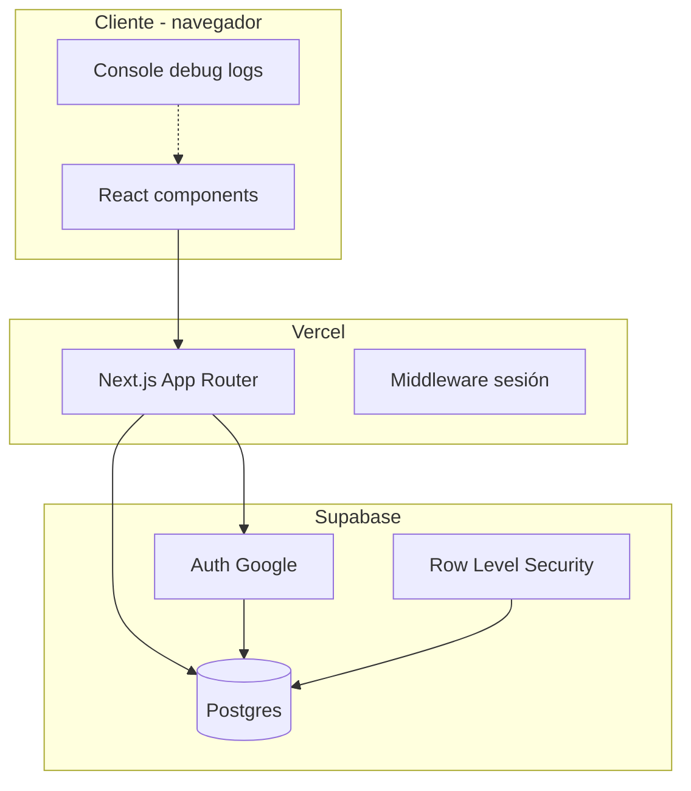

# Arquitectura — Life Manager

## 1. Visión general

Life Manager es un **monorepo**: un solo repositorio Git con varias apps. Hoy solo está activa la web; la app móvil (Expo) está planeada.

```text
life_manager/
├── apps/web/          ← Next.js (lo que ves en el navegador)
├── supabase/          ← Migraciones SQL (esquema de Postgres)
├── docs/              ← Documentación
└── package.json       ← Scripts raíz (db:push, dev:web)
```

## 2. Capas del sistema



### Capa 1 — Presentación (React)

- **Server Components** (por defecto en Next App Router): leen datos en el servidor, generan HTML.
  - Ejemplo: `player/citas/page.tsx` consulta Supabase y pasa datos a la tabla.
- **Client Components** (`"use client"`): interactividad en el navegador.
  - Ejemplo: `cita-form.tsx` (abrir formulario, agregar comentarios).
  - Ejemplo: `console-log.tsx` (logs en F12).

### Capa 2 — Aplicación (Next.js)

- **App Router** (`apps/web/src/app/`): cada carpeta = ruta URL.
- **Server Actions** (`actions.ts`): funciones que corren en servidor al enviar formularios.
- **Middleware** (`middleware.ts`): refresca cookies de sesión Supabase en cada request.

### Capa 3 — Backend (Supabase)

- **Auth**: Google OAuth → crea usuario en `auth.users` → trigger crea fila en `profiles`.
- **Postgres**: tablas `player_citas`, comentarios, jobs, etc.
- **RLS**: cada usuario solo ve filas donde `user_id = auth.uid()`.
- **GRANT**: permiso de rol `authenticated` para leer/escribir tablas vía API.

## 3. Flujo de login

```text
1. Usuario → /login → botón Google
2. Google → Supabase Auth callback
3. Supabase redirige → /auth/callback (Next)
4. Next intercambia code por sesión (cookies)
5. Redirect → /home
6. Trigger DB → profiles + user_jobs
```

## 4. Flujo PLAYER / citas

```text
1. /home → canAccessPlayerMenu() → link "Abrir citas"
2. /player/citas → SELECT player_citas WHERE user_id = sesión
3. SELECT comentarios por cita_id
4. CitasTable renderiza filas + badges
5. CitaForm → createCita() server action → INSERT
```

## 5. Control de acceso experimental

Archivo: `apps/web/src/lib/player/access.ts`

| Condición | Acceso menú PLAYER |
|---|---|
| UUID inaugural hardcodeado | Sí |
| `profiles.role = admin` | Sí |
| `experimental_profiles` contiene `'player'` | Sí |
| Resto de usuarios | No (redirect /home) |

## 6. TypeScript en el proyecto

- **Tipos de dominio**: `lib/player/constants.ts` (`PlayerColor`, `ComentarioTipo`, etc.)
- **Tipos de fila UI**: `components/player/citas-table.tsx` (`CitaRow`)
- **Sin `database.types.ts` generado aún** — tipos manuales por ahora

## 7. Decisiones de diseño

| Decisión | Por qué |
|---|---|
| Comentarios en tabla hija | N comentarios por cita (no columnas fijas) |
| Badges en UI, texto plano en DB | Excel usaba `' "` `()`; la app usa badges |
| Server Components para lista | Menos JS al cliente, datos frescos por request |
| Client Component para formulario | Estado local (comentarios dinámicos) |

## 8. Qué falta (roadmap)

- Compilaciones "mejores del año / de siempre" (scores ya listos)
- CRUD editar/borrar citas
- App móvil Expo
- Tipos auto-generados con `npm run db:types`
